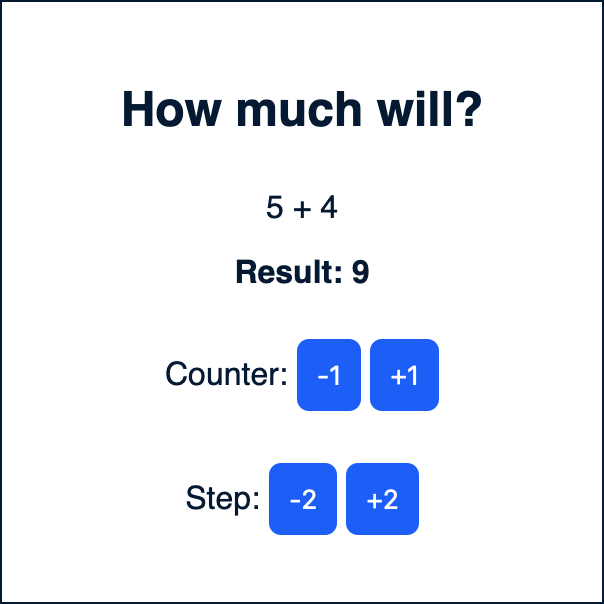
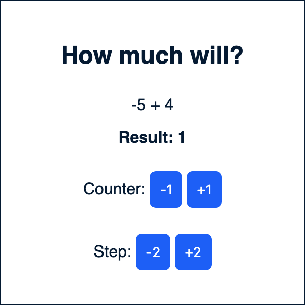

## Описание

Нужно реализовать методы, котрые будут считать результат сложения `counter` и `step`, при этом сами `counter` и `step` можно уменьшать и увеличивать на единицу нажатием на соответсвующие кнопки.

## Условия

`counter` изменяется с шагом 1
`step` изменяется с шагом в 2

*Результат может быть отрицательням.

## Задание

- Создайте реализацию на Vue
- Создайте реализацию на React
- Создайте реализацию на JS

## Пример

 

## Ссылка[Ссылка](https://evgenii2.github.io/reactivity/)
